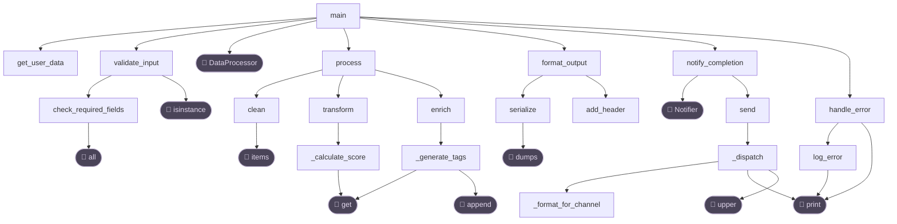

# Call Graph

```mermaid
graph TD
    N0["main"]
    N1["get_user_data"]
    N0 --> N1
    N2["validate_input"]
    N0 --> N2
    N3["check_required_fields"]
    N2 --> N3
    N4(["🔗 all"])
    style N4 fill:#4a4458,stroke:#b8a9c9,color:#e0d6eb
    N3 --> N4
    N5(["🔗 isinstance"])
    style N5 fill:#4a4458,stroke:#b8a9c9,color:#e0d6eb
    N2 --> N5
    N6(["🔗 DataProcessor"])
    style N6 fill:#4a4458,stroke:#b8a9c9,color:#e0d6eb
    N0 --> N6
    N7["process"]
    N0 --> N7
    N8["clean"]
    N7 --> N8
    N9(["🔗 items"])
    style N9 fill:#4a4458,stroke:#b8a9c9,color:#e0d6eb
    N8 --> N9
    N10["transform"]
    N7 --> N10
    N11["_calculate_score"]
    N10 --> N11
    N12(["🔗 get"])
    style N12 fill:#4a4458,stroke:#b8a9c9,color:#e0d6eb
    N11 --> N12
    N13["enrich"]
    N7 --> N13
    N14["_generate_tags"]
    N13 --> N14
    N12(["🔗 get"])
    style N12 fill:#4a4458,stroke:#b8a9c9,color:#e0d6eb
    N14 --> N12
    N15(["🔗 append"])
    style N15 fill:#4a4458,stroke:#b8a9c9,color:#e0d6eb
    N14 --> N15
    N16["format_output"]
    N0 --> N16
    N17["serialize"]
    N16 --> N17
    N18(["🔗 dumps"])
    style N18 fill:#4a4458,stroke:#b8a9c9,color:#e0d6eb
    N17 --> N18
    N19["add_header"]
    N16 --> N19
    N20["notify_completion"]
    N0 --> N20
    N21(["🔗 Notifier"])
    style N21 fill:#4a4458,stroke:#b8a9c9,color:#e0d6eb
    N20 --> N21
    N22["send"]
    N20 --> N22
    N23["_dispatch"]
    N22 --> N23
    N24["_format_for_channel"]
    N23 --> N24
    N25(["🔗 print"])
    style N25 fill:#4a4458,stroke:#b8a9c9,color:#e0d6eb
    N23 --> N25
    N26(["🔗 upper"])
    style N26 fill:#4a4458,stroke:#b8a9c9,color:#e0d6eb
    N23 --> N26
    N27["handle_error"]
    N0 --> N27
    N28["log_error"]
    N27 --> N28
    N25(["🔗 print"])
    style N25 fill:#4a4458,stroke:#b8a9c9,color:#e0d6eb
    N28 --> N25
    N25(["🔗 print"])
    style N25 fill:#4a4458,stroke:#b8a9c9,color:#e0d6eb
    N27 --> N25
```
